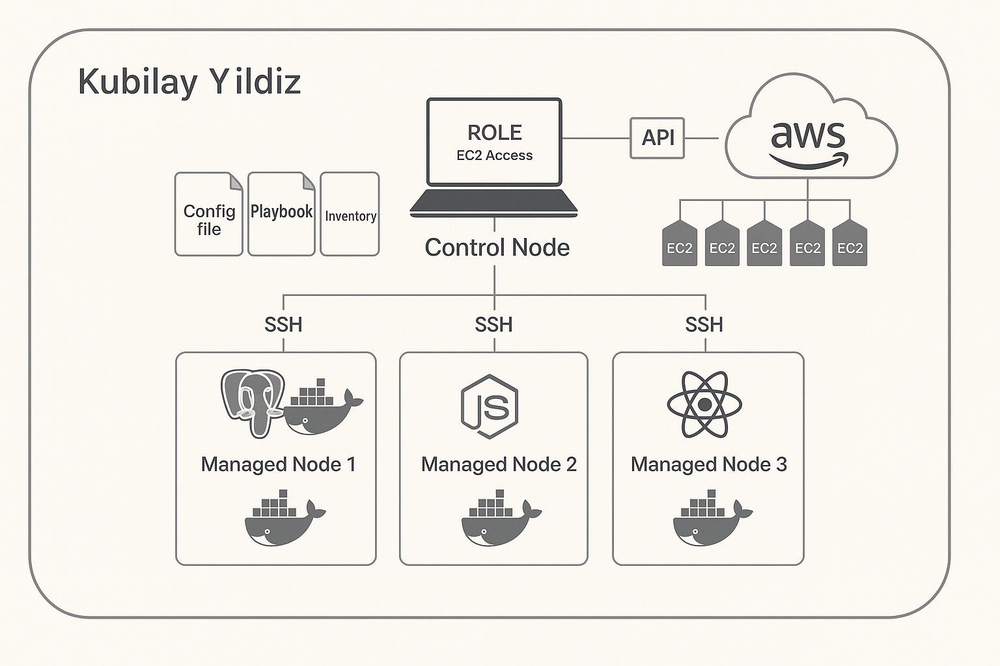

# Project : Todo Web Application (Postgresql-Nodejs-React) deployed on EC2's with Ansible and Docker

## Description

This project is a full-stack Todo Web Application built using PostgreSQL, Node.js, and React. The goal is to deploy the application on AWS infrastructure using Ansible for automation and Docker for containerization. The architecture consists of a control node and three EC2 instances serving as worker nodes, each dedicated to a specific component: database (PostgreSQL), backend (Node.js), and frontend (React).

All infrastructure configuration and application deployment steps are automated using Ansible. Each component runs inside a Docker container on its respective EC2 instance. The project demonstrates Infrastructure as Code (IaC) principles and DevOps practices such as CI/CD, configuration management, and containerization.

## Architecture Overview



PostgreSQL serves as the database.

Node.js manages backend logic and communicates with the PostgreSQL server.

React manages the frontend interface and communicates with the backend.

Each service runs in a Docker container on a separate EC2 instance.

All EC2 instances are provisioned via the AWS Console.

Ansible is used to automate:

Docker installation

File transfers

Image building

Container orchestration

Ansible Vault is used to securely handle sensitive data like database passwords.

## Requirements & Setup

 	Control Node Responsibilities:
 
 Manages the deployment process using Ansible playbooks.

 Uses dynamic inventory for EC2 instance discovery.

 Holds Ansible configuration and secret files (Ansible Vault).

 Pulls the todo-app-pern source code from GitHub.

 	PostgreSQL Node:
	
 Receives Dockerfile and init.sql file from control node.

 Builds Docker image and creates a container.

 Uses Docker volume to persist data.

 Accepts traffic on port 5432 from Node.js EC2 and SSH (port 22).
 
 	Node.js Backend Node:
	
 Receives the server folder from control node.

 Builds Docker image and runs the container on port 5000.

 Connects to PostgreSQL database via environment variables.

 Accepts traffic on port 5000 and SSH (port 22).

 	React Frontend Node:
	
 Receives the client folder from control node.

 Builds Docker image and runs the container on port 3000.

 Connects to backend via environment variables.

 Accepts traffic on ports 3000, 80, and SSH (port 22).
 
 

## Project Skeleton 

```text
todo-app-ansible-deployment/
|
|----Readme.md               
|----todo-app-pern (folder)  
|       1.server (folder) ---> Nodejs folders and files
|       2.client (folder) ---> React folders and files
|       3.database (folder)--> init.sql file 
|----developer_notes.txt     
|----Ansible-Playbook        
```

## Expected Outcome


### Features implemented;

Three deployment options:

Separate playbooks for each instance

Single monolithic playbook

Modular playbook with roles

Docker image creation and deployment via Ansible

Environment-specific .env file generation

Secure credential handling with Ansible Vault

EC2 security group configuration for open communication between services

React app accessible on port 3000 from any browser

### Technologies Used;

AWS – EC2, Security Groups

Ansible – Configuration management and automation

Docker – Containerization of services

Node.js – Backend application logic

React – Frontend user interface

PostgreSQL – Relational database

Git & GitHub – Version control and collaboration


### Learning outcomes;

Mastering Ansible playbook structures (flat and role-based)

Writing production-ready Dockerfiles

Using Ansible Vault for secrets management

Automating multi-tier application deployment

Managing stateful containers with volumes

Building end-to-end DevOps pipelines

## Resources

- [Ansible Documentation Framework](https://docs.ansible.com/ansible/2.5/user_guide/index.html)

- [AWS CLI Command Reference](https://docs.aws.amazon.com/cli/latest/index.html)
